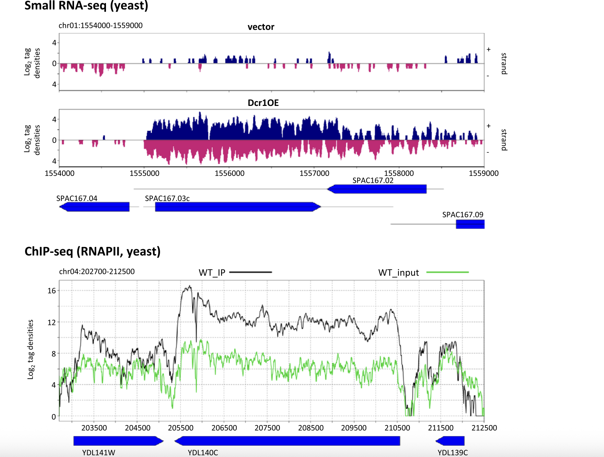
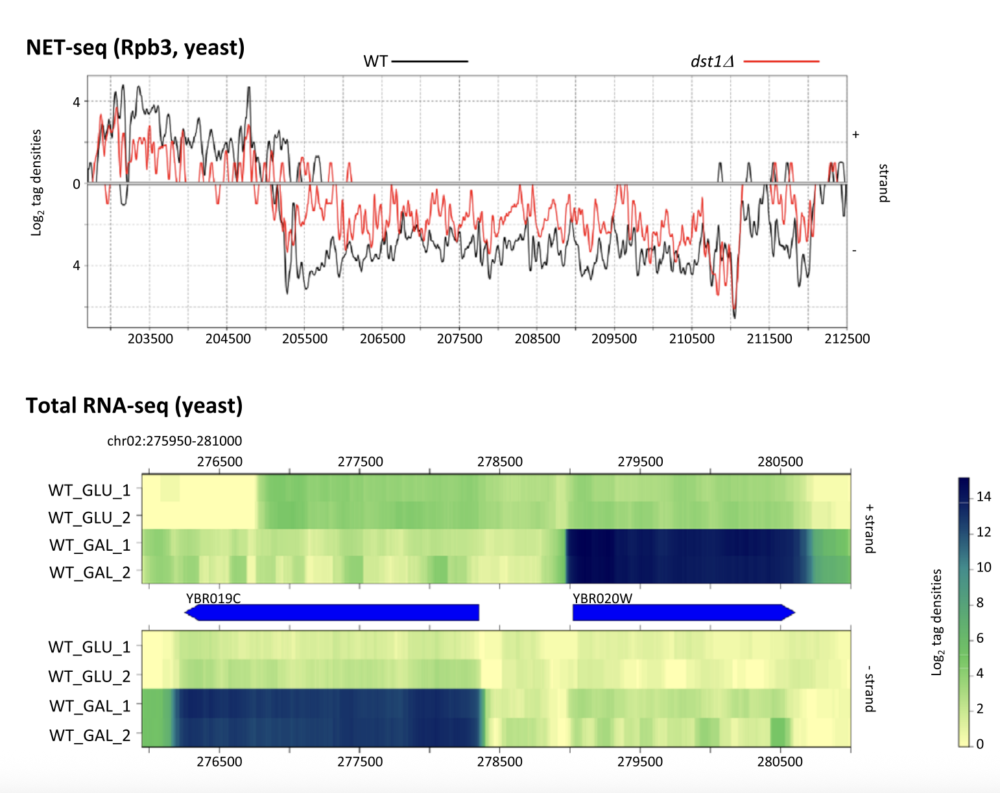

## Authors' notes and preface
--------------------------
The script in this package was designed by Marc Descrimes.
The current implementation was written by Marc Descrimes and Yousra Ben Zouari.

Software: Ving
Title: Representation and manipulation of of high-throughput sequencing (a.k.a. NGS) data.
Description: A tool for efficient visualization and analysis of NGS data.

Version: beta 1.1

## Prerequisites
-------------
The script runs with R (>= 3.0.2). 
R packages GenomicRanges and Rsamtools should be installed.
    http://bioconductor.org/packages/release/bioc/html/Rsamtools.html
    http://bioconductor.org/packages/release/bioc/html/GenomicRanges.html
    
R is a multi-platform software, thus Ving works on any system where R can be installed.
Ving has been successfully tested on Ubuntu (>= 12.04.2), MacOSX 10.9 and Windows 7.
This README file explains how to use Ving on a UNIX system.

Samtools should be up and running in order to create bam file indexes. 
Index files must be in the same directory as bam files, with the default 
file name given by samtools.
Samtools are in the repositories of many distros. Go here for the freshest version:
    http://samtools.sourceforge.net/

You should now be able to start using real data! 
Test files are available at :
    http://vm-gb.curie.fr/ving/

## How to use the Ving.R script
----------------------------
For additional help, just run: Rscript ving.R

Visualization requires at least one bam file and coordinates of a genome 
region to visualize: chromosome name, start and end.
    Rscript ving.R [options] <input> [<input2> <input3> ...]
As an example, to visualize positions 210400 to 224400 of chromosome 15 
from a file named WT1.bam, the minimal command line is:
    Rscript ving.R -c chr15 -S 210400 -E 224400 WT1.bam
    
This produces an "output.png" image with the default parameters.

Another example to visualize the same region with 4 bam files:
    Rscript ving.R -c chr15 -S 210400 -E 224400 WT1.bam WT2.bam mut1.bam mut2.bam
With a description for each bam file:
    Rscript ving.R -c chr15 -S 210400 -E 224400 -t "wild type 1" WT1.bam -t "wild type 2" WT2.bam -t "mutant 1" mut1.bam -t "mutant 2" mut2.bam
If two bam files have the same description, these two files will be pooled:
    Rscript ving.R -c chr15 -S 210400 -E 224400 -t "wild type" WT1.bam -t "wild type" WT2.bam -t "mutant" mut1.bam -t "mutant" mut2.bam
With normalization coefficients for each bam file:
    Rscript ving.R -c chr15 -S 210400 -E 224400 -t "wild type 1" WT1.bam -t "wild type 2" WT2.bam -t "mutant 1" mut1.bam -t "mutant 2" mut2.bam -n 0.8,1.2,1,0.5
To pool normalized data, set a normalization coefficient for each bam files:
    Rscript ving.R -c chr15 -S 210400 -E 224400 -t "wild type" WT1.bam -t "wild type" WT2.bam -t "mutant" mut1.bam -t "mutant" mut2.bam -n 0.8,1.2,1,0.5
    
Use chmod +x ving.R for running ving like this: ./ving.R
Just check the shebang in the first line of ving.R, it has to match the PATH of your Rscript.

Options
-------

-c/--chromosome-name <string>
    Name of chromosome to visualize.

-S/--start <integer>
    Leftmost nucleotide coordinate of genome region to visualize.

-E/--end <integer>
    Rightmost nucleotide coordinate of genome region to visualize.

-o/--output <string>
    Sets file name for Ving output. Default is "output.png".

-F/--fileType <string>
    Output format.
    By default, ving deduces the file type from the suffix of the file name set with -o
    The following file types are supported: png, jpeg, bmp, tiff, pdf.
    If another file type is specified, ving outputs a png file.
    Note: Heatmap visualizations appear to be better in png and tiff.

-R/--resolution <integer>
    Sets the resolution of the output, in dot per inch. Default is 72.
    
-v/--typeVisu <string>
    Changes visualization type. Default is "classic". Can also be "heatmap" or "lines".
    
-t/--description-data <string>
    Describes each data set with a name. Default is the file name.
    Example for multiple bam files:
	Rscript ving.R -c chr15 -S 210400 -E 224400 WT1.bam -t "wild type rep1" WT2.bam -t "wild type rep2"
    If two (or more) bam files have exactly the same name, ving will pool these bam files
    to generate only one signal.
    Example:
	Rscript ving.R -c chr15 -S 210400 -E 224400 WT1.bam -t "wild type" WT2.bam -t "wild type"

-n/--normalization-coefficient <number,number,...>
    By default no normalization is performed.
    Provide as many factors as there are bam files.
    Each bam file is multiplied by the corresponding factor. 
    For example, to normalize on total mapped read, assuming file WT1.bam has twice  
    more reads than file WT2.bam, then double each read in WT2.bam using this command: 
	Rscript ving.R -c chr15 -S 210400 -E 224400 WT1.bam WT2.bam -n 1,2
    To perform a Fragment Per Million mapped read (FPM) normalization, set for each 
    bam file a factor equal to (10^6)/<number of mapped fragments>
    
-i/--inverseStrand
    Use this if library type is fr-first-strand.
    All bam files are treated the same way.

-u/--unstranded
    Use for a non-strand-specific visualization
    Default is strand-specific.
    
-l/--scale-log
    Use for a logarithmic scale.
    Default is non-logarithmic.
    
-y/--symetric-scale
    Applies symetric scale with the same maximum and minimum
    for both strand in the "classic" and "lines" visualization.
    
-a/--annotation <string>
    Specifies an annotation file (GFF file). 
    Annotation features will be displayed on output image.
    More than one file can be provided:
	Rscript ving.R -c chr15 -S 210400 -E 224400 WT1.bam -a saccharomyces_cerevisiae.gff -a cryptics.gff 
    
-r/--typeTranscript <string>
    Selects annotation feature types for visualization. Enter feature types as a comma-separated list 
    (see column 3 of the gff file for the names of contained features)
    Example:
	Rscript ving.R -c chr15 -S 210400 -E 224400 WT1.bam -a saccharomyces_cerevisiae.gff -r gene,XUT
    
-C/--annotation-colors <string>
    Sets the different colors for annotation features. Any R color name is accepted.
    Hexadecimal color code is allowed, but without the "#" character.
    Use a comma-separated list. Number of colors and number of feature types should be the same.
    Example:
	Rscript ving.R -c chr15 -S 210400 -E 224400 WT1.bam -a saccharomyces_cerevisiae.gff -a cryptics.gff -r gene,XUT,SUT -C blue,salmon,649B88
    
--annotation-color-by-strand
    Use this for coloring transcripts according to their strand.
    Overrides -C/--annotation-colors
    
-s/--annotation-shapes <string>
    Sets the shape used for annotation (Comma-separated list).
    Four shapes are available: box,rectangle,arrow,line. Default is box.
    Numbers of shapes and feature types should be the same.
    For organisms with few or no introns (e.g. yeast), we suggest to use "box" for every type of feature.
    Otherwise, we suggest to use "rectangle" for exons and "arrow" for introns.
    
--classic-plus-color <string>
    Sets the color of plus strand for classic visualization.
    Also sets the color of plus strand annotations when --annotation-color-by-strand 
    is used.
    
--classic-minus-color <string>
    Sets the color of minus strand for classic visualization.
    Also sets the color of minus strand annotations when --annotation-color-by-strand 
    is used.
    Example:
	Rscript ving.R -c chr15 -S 210400 -E 224400 WT1.bam WT2.bam -n 0.5,1.5 --classic-plus-color=darkred --classic-minus-color=gold
    
--heatmap-max-color <string>
    Sets the maximum color of the palette for heatmap visualization.
    
--heatmap-min-color <string>
    Sets the minimum color of the palette for heatmap visualization.
    
--heatmap-palette-method <string>
    Sets the method of the palette for the heatmap visualization.
    Two settings:
      - hsv: varies the hues
      - rgb: varies the shades
    Default is hsv.
    Example:
	Rscript ving.R -v heatmap -c chr15 -S 210400 -E 224400 WT1.bam WT2.bam --heatmap-min-color=lavenderblush --heatmap-max-color=darksalmon
	Rscript ving.R -v heatmap -c chr15 -S 210400 -E 224400 WT1.bam WT2.bam --heatmap-min-color=white --heatmap-max-color=black --heatmap-palette-method=rgb
    
--lines-samples-colors <string,string,...>
    Sets the colors for lines visualization (comma-separated list).
    Enter as many colors as there are bam files.
    
--lines-samples-type-line <integer,integer,...>
    Sets the type of lines for lines visualization (comma-separated list). 
    Enter as many line types as there are bam files.
    Example:
	Rscript ving.R -v lines -c chr15 -S 210400 -E 224400 WT1.bam WT2.bam mut1.bam mut2.bam -l --lines-samples-colors=1,1,2,2 --lines-samples-type-line=1,2,1,2

-L/--smoothLength <number>
    Sets the length of the sliding window smoothing. If not set, ving computes an 
    optimal window length, according to the length of the requested display region.
    To avoid any smoothing, set this to zero.
	
Examples:
  Rscript ving.R -o classic.png -c chr15 -S 210400 -E 224400 WT1.bam -t "wild type rep1" WT2.bam -t "wild type rep2" mut1.bam -t "mutant rep1" mut2.bam -t "mutant rep2" -a saccharomyces_cerevisiae.gff -a cryptics.gff -r gene,XUT,SUT -C blue,salmon,649B88
  Rscript ving.R -v heatmap -o heatmap.png -c chr15 -S 210400 -E 224400 WT1.bam -t "wild type rep1" WT2.bam -t "wild type rep2" mut1.bam -t "mutant rep1" mut2.bam -t "mutant rep2" -l -a saccharomyces_cerevisiae.gff -a cryptics.gff -r gene,XUT,SUT -C blue,salmon,649B88
  Rscript ving.R -v lines -o lines.png -c chr15 -S 210400 -E 224400 WT1.bam -t "wild type rep1" WT2.bam -t "wild type rep2" mut1.bam -t "mutant rep1" mut2.bam -t "mutant rep2" -l -a saccharomyces_cerevisiae.gff -a cryptics.gff -r gene,XUT,SUT -C blue,salmon,649B88 --lines-samples-colors=black,black,green,green --lines-samples-type-line=1,2,1,2

## Publication: 
(https://doi.org/10.1186/s13104-015-1404-5)
